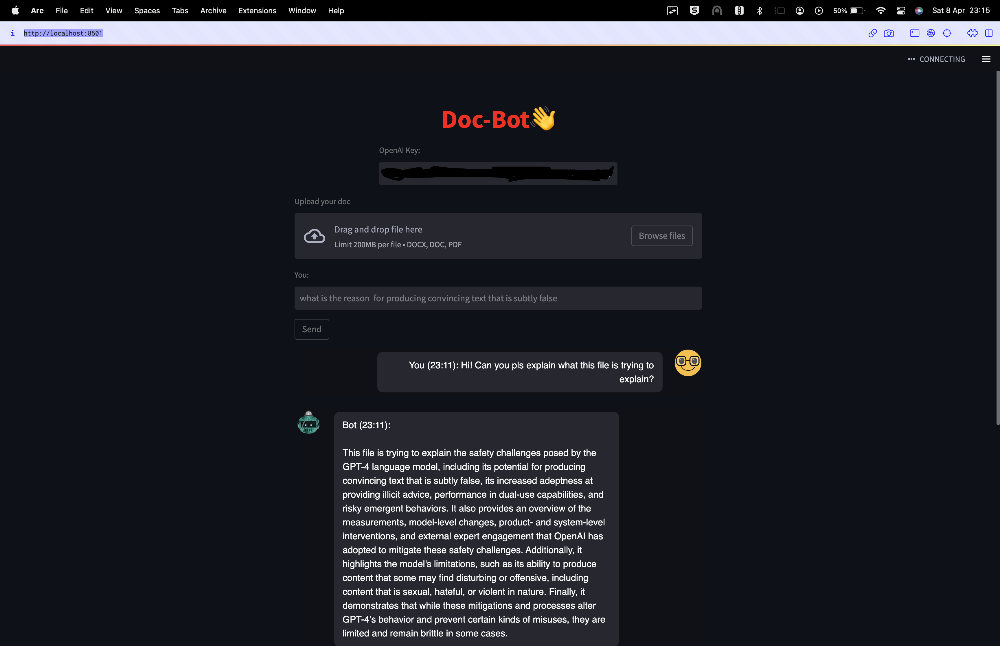

## Doc-Bot

<div>
<p>Doc-Bot is an interactive document chatbot built using the <b>Streamlit</b> framework and the <b>OpenAI</b> API. Its main purpose is to help users understand their documents by summarizing them and allowing them to ask questions about their content. </p>
</div>




### Installation


To run Doc-Bot, you need to have Python 3 installed on your machine, as well as the following packages:
* <b>streamlit</b>
* <b>datetime</b>
* <b>streamlit_chat</b>
* <b>llama_index</b>
<p>You can install these packages using the following command:</p>

```
 pip install -r requirements.txt
```

</div>

### Usage
<p>
To use Doc-Bot, you need to run the doc_bot.py file in your terminal or IDE. This will start a Streamlit web application that you can access in your browser at <b>http://localhost:8501</b>.
</p>

<p>
Once the app is running, you can upload a document in the supported formats (.docx, .doc, or .pdf) by clicking on the "Upload your doc" button. Doc-Bot will then summarize the document and index its content using the <b>GPTSimpleVectorIndex</b> algorithm from the <b>llama_index</b> package.
</p>

<p>
You can then type a question or query in the input text box and click on the "Send" button to get a response from Doc-Bot. The bot will use the OpenAI API to generate a response based on the indexed content of the document.
</p>

<p>
Doc-Bot will also display a chat log of all the messages exchanged between the user and the bot, including the time and date of each message.
</p>

### Credits
<p>
Doc-Bot was built by <b>Shashank Vats</b> as a demo project using the Streamlit framework, the OpenAI API, and the llama_index package.
</p>


